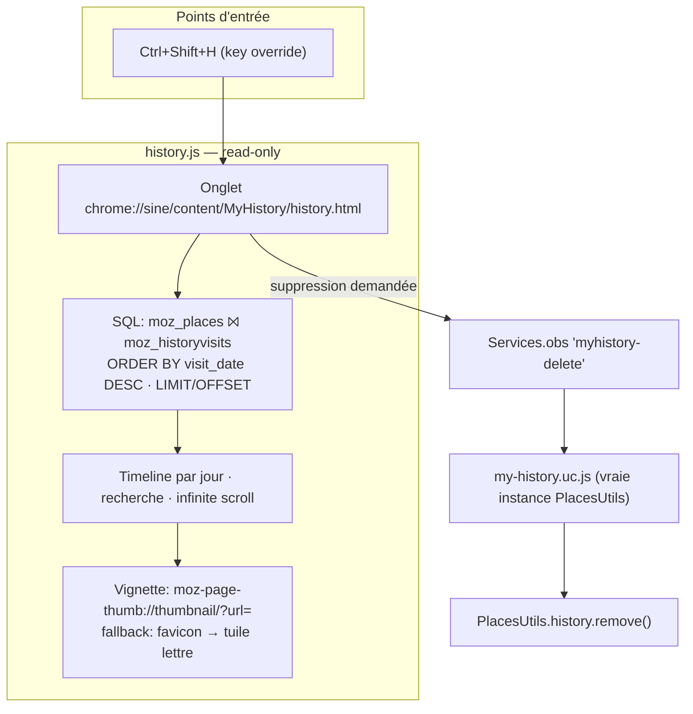

# MyHistory — SPEC V1

> **Vision** : remplacer l'historique Zen/Firefox (fenêtre `places.xhtml`, poussiéreuse)
> par une vraie page web stylée dans un onglet : timeline groupée par jour, recherche
> instantanée, vignettes quand disponibles, favicons en cascade de fallback.
>
> **Mod 100% indépendant** — zéro dépendance à MyHub ou autre mod. Toute future
> intégration passera par un contrat déclaratif (`preferences.json` + convention icône),
> jamais par du couplage.

## Pourquoi

- L'UI historique native est le point faible n°1 de Zen : fenêtre séparée moche, popup peu pratique.
- Aucune extension Firefox ne fait ça (les WebExtensions n'ont accès ni aux thumbnails
  `moz-page-thumb://`, ni facilement aux favicons). La route uc.js n'a **aucune** de ces limites.
- Référence conceptuelle : l'historique natif de Vivaldi (`vivaldi://history/`).

## Structure du mod

```
MyHistory/
├── theme.json           # Sine — 1 script (my-history.uc.js, browser.xhtml)
├── my-history.uc.js     # Orchestrateur (contexte browser.xhtml)
├── history.html         # La page — chrome://sine/content/MyHistory/history.html
├── history.css          # Styles de la page
├── history.js           # Logique de la page (SQL Places, rendu, recherche)
├── resources/
│   └── MyHistory.png    # Icône (tab bar + future intégration hub)
└── SPEC.md              # Ce fichier
```

## Séparation des responsabilités

Le pattern MyHub éprouvé : la page tourne dans un contexte où `importESModule` charge des
instances **séparées** de celles du browser. Conséquence :

| Contexte | Fichier | Rôle |
|---|---|---|
| Page (onglet) | `history.js` | **Lectures seules** : SQL read-only via `PlacesUtils.promiseDBConnection()` (`moz_places ⨝ moz_historyvisits`), rendu DOM, recherche instantanée, IntersectionObserver (infinite scroll), rendu vignettes `moz-page-thumb://` + fallbacks favicon |
| Browser | `my-history.uc.js` | ① Hotkey **Ctrl+Shift+H** → open-or-focus l'onglet (pattern `openHub()` de MyHub) ② Icône de tab via `TabAttrModified`/`TabSelect` ③ **Écritures** : exécutant des commandes one-shot notifiées par `Services.obs` (`myhistory-*`) ④ (V1.1) Harvester de vignettes |

**Règle d'or** : la page ne JAMAIS écrire dans Places. Uniquement du read-only SQL.
Les deletes passent par `Services.obs` → le `.uc.js` (vraie instance `PlacesUtils.history.remove()`).

## Architecture V1.0



## UX V1.0

- **Header sticky** : recherche (filtre instantané titre/URL) + chips de filtres temporels
  (`Aujourd'hui`, `Hier`, `7 jours`, `Tous`)
- **Timeline verticale** : une section par jour ("Aujourd'hui — X sites · Y visites"),
  cartes en grid responsive
- **La carte** : zone vignette 16:10 → fallback favicon large sur fond teinté (teinte
  dérivée d'un hash du domaine, pour une grid harmonisée même sans thumbnails) → tuile lettre.
  Sous la vignette : favicon + titre tronqué, domaine · heure
- **Hover** : overlay actions — *Ouvrir* (clic = nouveau tab), *Copier l'URL*, *Oublier*
- **Vide/chargement** : états squelettes (skeleton cards), jamais d'écran blanc

## Design

**S'inspirer du design de MyHub** (manager.html/css) — même langage visuel ( palette,
transparences, family de composants) pour une cohérence d'écosystème — MAIS avec un
contenu **beaucoup plus large** : MyHistory n'est pas un panneau de config, c'est une
page pleine destinée à afficher beaucoup de données (grid multi-colonnes responsive,
largeur de contenu étendue, pas de contrainte de panel).

## Décisions tranchées

1. **Pas de registrar `about:`** — Sine sert déjà les fichiers de mods via
   `chrome://sine/content/<modId>/...` (pattern MyHub `manager.html`).
2. **V1.0 favicon-first** — le stock `moz-page-thumb` du profil est partiel au jour 0 ;
   le design doit être beau SANS vignettes. Elles sont un bonus, pas une dépendance.
3. **Zéro polling** (credo Event Driven Only) — rechargements sur événements
   (input, IntersectionObserver, obs notifications), aucun timer.
4. **Pagination SQL** (`LIMIT/OFFSET` ou keyset sur `visit_date`) — jamais tout charger en mémoire.

## Phasing

| Version | Contenu |
|---|---|
| **V1.0** | Page + SQL + groupement par jour + recherche + fallback favicons + hotkey Ctrl+Shift+H |
| **V1.1** | Harvester vignettes (`addTabsProgressListener` → `PageThumbs.captureAndStoreIfStale`) + live refresh de la page ouverte via `Services.obs` |
| **V1.2** | Suppression (entrée / journée), toggle densité (vignettes / compact / liste) |
| **V2** | Vue fréquence (sites les plus visités), stats par jour, contrat MyHub (`preferences.json` + icône `resources/MyHistory.png`) |

## Risques connus

- **Couverture thumbnails jour 0** : partielle — assumé (V1.0 favicon-first, harvester en V1.1).
- **Rétention PageThumbs** : le stock `thumbnails/` est expiré par Firefox — vérifier la
  pref `toolkit.pageThumbs.minWidth`/rétention au moment du harvester, si besoin étendre.
- **Charge SQL** : historiques très gros → keyset pagination + index `visit_date` existant.

## Workflow de création (Sine-Workflow)

1. ⬜ Créer les fichiers dans `Sine-Mods/MyHistory/` (cette spec, puis code)
2. ⬜ `git init -b main` + commit + `gh repo create Impre-dev/MyHistory --public --source=. --push`
3. ⬜ Install via UI Sine (Zen → Sine → Add : `Impre-dev/MyHistory`)
4. ⬜ Restart Zen — mod chargé ET enregistré dans `mods.json`
5. ⬜ Itérations : éditer DANS le profil (`chrome/sine-mods/MyHistory/`), restart pour valider
6. ⬜ Sync final profil → `Sine-Mods/MyHistory/`, commit + push
